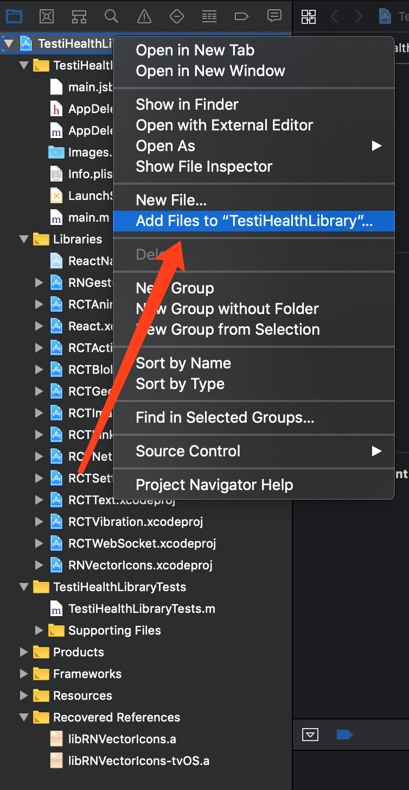
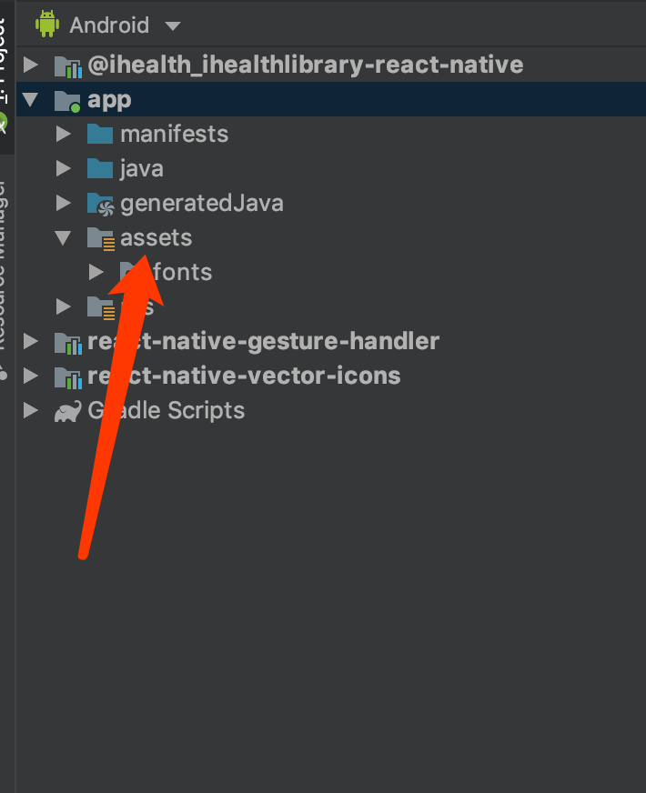

# iHealth device sdk

## Installation

### Using npm

```shell
npm install --save @ihealth/ihealthlibrary-react-native
```

### Using yarn

```shell
yarn add @ihealth/ihealthlibrary-react-native
```

## Usage

### Authentication

#### Download license file

1. Sign up iHealth developer webside. [Please sign up here](https://dev.ihealthlabs.com)
2. Press "Add New App" button, fill in your information of your app. We will get email and active the license for your app.
3. Download license file, as shown below.


#### Integrate license file

For iOS
As shown below, Add your license file to your iOS project.


For Android
As show below, Add your license file to your asserts folder.


#### Using license file

```js
import { iHealthDeviceManagerModule } from '@ihealth/ihealthlibrary-react-native';

// your license file
const filename = 'license.pem';
iHealthDeviceManagerModule.sdkAuthWithLicense(filename);
```

### Troubleshooting

#### For Android

1. Check settings.gradle file in your android project and node_modules, make sure input the correct module path.

```gradle
include ':ihealthlibrary-react-native'
project(':ihealthlibrary-react-native').projectDir = new File(rootProject.projectDir,'../node_modules/@ihealth/ihealthlibrary-react-native/android')
```

2. Check build.gradle file in your android project, make sure the ihealth module is integrated

```gradle
compile project(':@ihealth_ihealthlibrary-react-native')
```

3. Import iHealth module in your MainActivity.java

```java
protected List<ReactPackage> getPackages() {  
	return Arrays.<ReactPackage>asList(
		new MainReactPackage(),
		new iHealthDeviceManagerPackage()
	);  
}
```

4. Location permission(in AndroidManifest.xml)

```xml
<!-- Need ACCESS_COARSE_LOCATION or ACCESS_FINE_LOCATION permission in Android API 23+ -->
<uses-permission android:name="android.permission.ACCESS_FINE_LOCATION" />
<uses-permission android:name="android.permission.ACCESS_COARSE_LOCATION" />
```

#### For iOS

1. Open your iOS project, add node_modules/@ihealth/ihealthlibrary-react-native/ios/ReactNativeIOSLibrary.xcodeproj to libraries
2. Under 'Build Phases' --  'Link Binary With Libraries', add libReactNativeIOSLibrary.a

### Example

iHealth SDK module is based on DeviceEventEmitter, So call add listener while the component is loaded, and call remove listener while the component is unloaded, As show as below. If you want more detail information, Please the example code.

```js
componentDidMount() {
    iHealthAPI.addListener();
}

componentWillUnmount() {
    iHealthAPI.removeListener();
}
```

#### For bluetooth LE or regular bluetooth device

##### search device

```js
import { iHealthDeviceManagerModule } from '@ihealth/ihealthlibrary-react-native';
const type = 'BP5'; // AM3S, AM4, BG5, BG5S, BP3L, BP5, BP5S, BP7S, HS2, HS4S, PO3,HS2S,BG1S
iHealthDeviceManagerModule.startDiscovery(type);
```

##### connect device

```js
import { iHealthDeviceManagerModule } from '@ihealth/ihealthlibrary-react-native';
const mac = 'xxxxxxxxxxxxxx';
const type = 'BP5'; // AM3S, AM4, BG5, BG5S, BP3L, BP5, BP5S, BP7S, HS2, HS4S, PO3,HS2S,BG1S
iHealthDeviceManagerModule.connectDevice(mac, type);
```

##### device workflow

[AM3S workflow](./doc/am3s.md)
[AM4 workflow](./doc/am4.md)
[AM5 workflow](./doc/am5.md)
[BG1 workflow](./doc/bg1.md)
[BG5 workflow](./doc/bg5.md)
[BG5S workflow](./doc/bg5s.md)
[BP3L workflow](./doc/bp3l.md)
[BP5 workflow](./doc/bp5.md)
[BP5S workflow](./doc/bp5s.md)
[BP7S workflow](./doc/bp7s.md)
[HS2 workflow](./doc/hs2.md)
[HS4S workflow](./doc/hs4s.md)
[HS6 workflow](./doc/hs6.md)
[PO3 workflow](./doc/po3.md)
[HS2S workflow](./doc/hs2s.md)
[BG1S workflow](./doc/bg1s.md)
